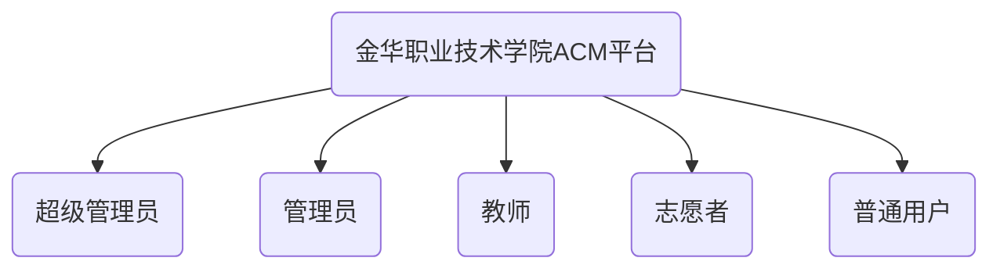
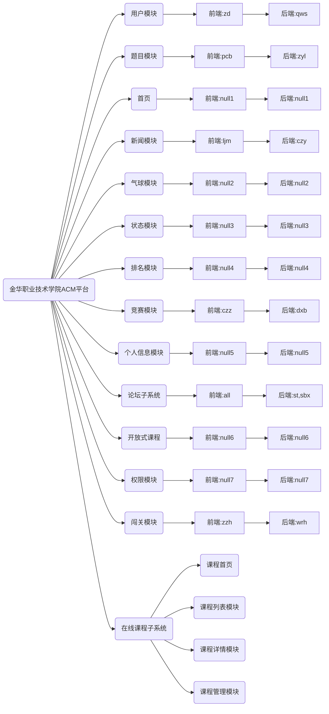

# 金华职业技术学院52AC平台开发手册

> 本平台采用前后端分离的开发方式  
> 前端: Vue3  
> 后端: Django
> 数据库: MySql
> 缓存: Redis

## 1. 前端开发命名规范

### （一）主体

```text
头：header
内容：content/container
尾：footer
导航：nav
侧栏：sidebar
栏目：column
页面外围控制整体布局宽度：wrapper
左右中：leftright center
登录条：loginbar
标志：logo
广告：banner
页面主体：main
热点：hot
新闻：news
下载：download
子导航：subnav
菜单：menu
子菜单：submenu
搜索：search
友情链接：friendlink
页脚：footer
版权：copyright
滚动：scroll
内容：content
标签页：tab
文章列表：list
提示信息：msg
小技巧：tips
栏目标题：title
加入：joinus
指南：guild
服务：service
注册：regsiter
状态：status
投票：vote
合作伙伴：partner
```

### (二)css注释的写法

```text
/*内容区*/　
Html注释的写法：<!--header头部-- >
```

### (三)id的命名

#### (1)页面结构

```text
容器:container
页头：header
内容：content/container 
页面主体：main
页尾：footer
导航：nav 
侧栏：sidebar
栏目：column
页面外围控制整体布局宽度：wrapper 
左右中：leftright center
```

#### (2)导航

```text
导航：nav
主导航：mainnav
子导航：subnav 
顶导航：topnav
边导航：sidebar
左导航：leftsidebar 
右导航：rightsideba
菜单：menu
子菜单：submenu 
标题: title
摘要: summary
#### (3)功能　　
标志：logo
广告：banner
登陆：login
登录条：loginbar 
注册：regsiter
搜索：search
功能区：shop 
标题：title
加入：joinus 
状态：status
按钮：btn 
滚动：scroll
标签页：tab
文章列表：list
提示信息：msg 
当前的: current
小技巧：tips
图标: icon
注释：note 
指南：guild
服务：service
热点：hot
新闻：news 
下载：download
投票：vote
合作伙伴：partner 
友情链接：link
版权：copyright
```

### (四)class的命名

#### (1)颜色:使用颜色的名称或者16进制代码,如　　

`.red {color: red; } .f60 { color: #f60;} .ff8600 { color: #ff8600; }`

#### (2)字体大小,直接使用’font+字体大小’作为名称,如　　

`.font12px{ font-size: 12px; } .font9pt{font-size: 9pt; }`

#### (3)对齐样式,使用对齐目标的英文名称,如　　

`.left {float:left; } .bottom {float:bottom; }`

#### (4)标题栏样式,使用’类别+功能’的方式命名,如

`.barnews { } .barproduct { }`

```text
主要的 master.css　　
模块module.css　　
基本共用base.css 　　
布局，版面layout.css　　
主题themes.css　　
专栏columns.css 　　
文字font.css　　
表单forms.css　　
补丁mend.css　　
打印print.css
```

## 2. 后端开发命名规范

- ### 后端开发样例模板

``` python
'''
creator : yby
createTime: 2020.12.03
description:课程页面首页数据
status:开发
updateTime:2020.12.24
remask:传回listType字段，通过该变量判断传回的四个课程是什么类型的课程
'''
def courseIndex(request):
    listType = int(request.GET.get('listType','0'))
    if listType == 1:   #最热课程
        with connection.cursor() as cursor:
            cursor.execute("SELECT courses.course_id, courses.title, courses.`explain`, courses.type_id, courses.price, courses.photo_add, courses.evaluation_num, courses.view_num, courses.browse_num, courses.member_num FROM courses WHERE courses.defunct = 0 AND courses.`status` = 'published' ORDER BY courses.member_num DESC LIMIT 4")
            solution_data = cursor.fetchall()
        solution_data = list(solution_data)
    elif listType == 2: #推荐课程
        with connection.cursor() as cursor:
            cursor.execute("SELECT courses.course_id, courses.title, courses.`explain`, courses.type_id, courses.price, courses.photo_add, courses.evaluation_num, courses.view_num, courses.browse_num, courses.member_num FROM course_commend , courses WHERE course_commend.course_id = courses.course_id AND course_commend.defunct = 0 AND courses.defunct = 0 AND courses.`status` = 'published' ORDER BY course_commend.display_num ASC LIMIT 4 ")
            solution_data = cursor.fetchall()
        solution_data = list(solution_data)
    else:   #否则最新
        with connection.cursor() as cursor:
            cursor.execute("SELECT courses.course_id, courses.title, courses.`explain`, courses.type_id, courses.price, courses.photo_add, courses.evaluation_num, courses.view_num, courses.browse_num, courses.member_num FROM courses WHERE courses.defunct = 0 AND courses.`status` = 'published' ORDER BY courses.create_time DESC LIMIT 4")
            solution_data = cursor.fetchall()
        solution_data = list(solution_data)

    ans_data = []
    for data in solution_data:
        ans_data.append({
            'course_id':data[0],
            'title':data[1],
            'explain':data[2],
            'type_id':data[3],
            'price':data[4],
            'photo_add':data[5],
            'evaluation_num':data[6],
            'view_num':data[7],
            'browse_num':data[8],
            'member_num':data[9]
        })
    result = {"data":ans_data}
    return JsonResponse(result,safe=False)
```

### 1. 模块开发要求
>
> 1. 每个模块前面必须注释写明创建者，创建时间，模块名称，开发状态，最后一次升级时间以及此模块的作用
> 2. 在开发过程中必要的地方需加入注释说明
> 3. 如无特殊情况, 文件一律使用 UTF-8 编码
如无特殊情况, 文件头部必须加入`#--coding:utf-8--`标识
> 4. 缩进统一使用4个空格进行缩进，每行代码尽量不超过 80 个字符(在特殊情况下可以略微超过 80 ，但最长不得超过 120)

### 2. Python开发命名规范

#### 1. 常用命名法

- 驼峰命名法

> 混合使用大小写字母来构成变量和函数的名字，以大写字母代替语句间隔的命名方法。程序员们为了自己的代码能更容易的在同行之间交流，所以多采取统一的可读性比较好的命名方式。
>
> - 大驼峰命名：首字母大写。如CamelCase、JavaScript，HelloWorld等。
> - 小驼峰命名：首字母小写。如camelCase、myName、myNumber等。

- 下划线命名法

> 使用下划线来代替单词间隔的命名方法，部分语言已经将这个方法用小驼峰法代替。如this_is_my_number、print_something、my_name等。

<kbd> 这个命名方式在Python中很常用。</kbd>

- 匈牙利命名法

> Microsoft 程序员查尔斯- 西蒙尼(Charles Simonyi) 提出的，通过在变量名前面加上相应的小写字母的符号标识作为前缀，标识出变量的作用域，类型等这些符号可以多个同时使用。如 i_number：int型数字，p_one：指针变量，m_lpszStr：一个以0字符结尾的字符串的长指针成员变量。

- 帕斯卡命名法

>（同大驼峰命名）

- 其它命名法

> 如 _number、0xffffffff、$value等

***这里函数名使用小驼峰命名法，变量名使用下划线命名法***

#### 2. Python命名规则
>
> 1. 变量名区分大小写；
> 1. 严禁使用关键字作为变量名；
> 1. 确定自己的命名风格，不可随意变换；
> 1. 命名应该科学严谨，切勿太长或者表达比较模糊；
> 1. 命名中若使用特殊约定或缩写，则要有注释说明；
> 1. 尽量不要使用中文字符和纯数学字符，避免编码错误；
> 1. 名字由英文字母、数字、下划线组成，如abc，abc13和_abc等；
> 1. 要清晰、明了，有明确含义，同时使用完整的单词或大家基本可以理解的缩写；
> 1. 同一软件产品内，应规划好接口部分(变量、结构、函数及常量)的命名，防止编译、链接时产生冲突。
>
#### 3. Python中命名参考

类型|公有/外部成员|私有/内部成员
:-:|:-:|:-:
模块（module）|my_naming_convention |_my_naming_convention
包（package）|my_naming_convention  
类（class）|MyNamingConvention |_MyNamingConvention
异常（Exception）|MyNamingConvention  
函数（function）|my_naming_convention() |_my_naming_convention()
全局/类常量（constant）|MY_NAMING_CONVENTION |_MY_NAMING_CONVENTION
全局/类变量（variable）|my_naming_convention |_my_naming_convention

## 后台开发思维导图

- 角色分布图



- 模块开发图



## 数据库完善度

- 文件模块
  - [x] bankfile <kbd>文件夹表</kbd>

- 用户模块
  - [x] Users <kbd>用户表</kbd>
  - [x] UserPassword <kbd>密码表</kbd>
  - [x] Loginlog <kbd>登录日志</kbd>
  - [x] college <kbd>学院表</kbd>
  - [x] user_ip <kbd>限制用户ip</kbd>
  - 班级管理
    - [x] class
    - [x] class_user

- 题目模块
  - [x] Problems <kbd>问题表</kbd>
  - [x] solution <kbd>提交问题信息表</kbd>
  - [x] collection <kbd>个人收藏表</kbd>
  - [x] source_code <kbd>上传的代码</kbd>
  - [x] source_code_user  <kbd>上传代码的用户</kbd>
  - [x] sim <kbd>判重表</kbd>
  - [x] CompileieInfo <kbd>编译错误表</kbd>
  - [x] runtimeinfo <kbd>运行错误表</kbd>
  - [x] problem_tag <kbd>问题标签</kbd>
  - [x] problem_source <kbd>问题来源</kbd>

- 新闻模块
  - [x] news <kbd>新闻表</kbd>

- 气球模块
  - [x] balloon <kbd>气球表</kbd>
  - [x] printer <kbd>打印表</kbd>

- 竞赛模块
  - [x] contest <kbd>竞赛表</kbd>
  - [x] contest_problem <kbd>竞赛问题表</kbd>
  - [x] contest_user <kbd>竞赛用户表</kbd>

- 论坛子系统
  - [x] form_section <kbd>论坛主板表</kbd>
  - [x] post <kbd>帖子表</kbd>
  - [x] reply <kbd>回复表</kbd>

- 闯关模块
  - [x] level <kbd>关卡表</kbd>
  - [x] level_kind <kbd>关卡类型表</kbd>
  - [x] level_pass <kbd>过关者</kbd>
  - [x] level_problem <kbd>关卡问题表</kbd>

- 在线课程子系统
  - [ ] course_class
  - [ ] course_collection
  - [ ] course_commend
  - [ ] course_common_class
  - [ ] course_evaluation
  - [ ] course_member
  - [ ] course_new
  - [ ] course_question
  - [ ] course_question_bank
  - [ ] course_type
  - [ ] courses
  - [ ] courseware <kbd>课件</kbd>
  - 问题
    - [ ] task
    - [ ] task_question
    - [ ] task_question_distribution
    - [ ] task_sumbit
  - 章节
    - [ ] chapter
    - [ ] chapter_content
  - 课件
    - [ ] resource_bank <kbd>课件文件</kbd>

## 功能完善度

- [x] 用户模块
  - 普通用户
    - [x] 注册
    - [x] 登录
    - [x] 用户信息完善
    - [x] 用户个人信息查看
    - [x] 用户个人信息修改
    - [x] 用户个人密码修改
    - [x] 忘记密码
    - [x] 邮箱绑定
    - [x] 用户排名
    - [x] 用户状态
  - 管理员
    - [x] 用户信息列表获取
    - [x] 用户角色修改
    - [x] 用户密码修改
   

- [ ] 题目模块
  - [ ] 题目列表
  - [ ] 题目信息
  - [ ] 题目提交
  - [ ] 题目提交状态
  - [ ] 题目查询
  - [ ] 题目标签列表
  - [ ] 题目来源列表
  - [ ] 题目管理
    - [ ] 题目添加
    - [ ] 题目修改
    - [ ] 题目隐藏
    - [ ] 题目删除
    - [ ] 题目重判
  - [ ] 题解列表
  - [ ] 题解内容
  - [ ] 题解添加
  - [ ] 个人题解管理
    - [ ] 题解删除
    - [ ] 题解修改
  - [ ] 管理员题解管理
    - [ ] 题解添加
    - [ ] 题解修改
    - [ ] 题解删除
    - [ ] 题解审核

- [ ] 首页

- [ ] 新闻模块
  - [ ] 新闻轮播图显示
  - [ ] 新闻公告列表
  - [ ] 新闻详情
  - [ ] 新闻轮播图管理
    - [ ] 图片添加
    - [ ] 图片修改
    - [ ] 图片删除
  - [ ] 新闻公告管理
    - [ ] 公告添加
    - [ ] 公告删除
    - [ ] 公告修改

- [ ] 气球模块

- [ ] 状态模块
  - [ ] 状态查询与排序
  - [ ] 判题结果查看

- [ ] 排名模块
- [ ] 竞赛模块
- [ ] 个人信息模块
- [ ] 论坛子系统
- [ ] 开放式课程
- [ ] 权限模块
- [ ] 闯关模块

- [ ] 在线课程子系统
  - [ ] 课程首页
  - [ ] 课程列表模块
  - [ ] 课程详情模块
  - [ ] 课程管理模块

- [ ] 论坛模块
  - [x] 进入论坛
  - [x] 添加帖子
  - [x] 查看自己的帖子
  - [x] 修改帖子
  - [x] 删除帖子
  - [x] 撤销删除帖子
  - [x] 查看帖子
  - [x] 添加回复
  - [X] 修改回复
  - [x] 删除回复
  - [x] 查看回复和删除自己帖子的回复
  - [x] 点赞收藏
  - [x] 查看和删除论坛收藏
  - [ ] 管理员论坛功能
    - [x] 进入管理论坛 
    - [x] 删除帖子
    - [x] 审核帖子
    - [x] 删除回复
